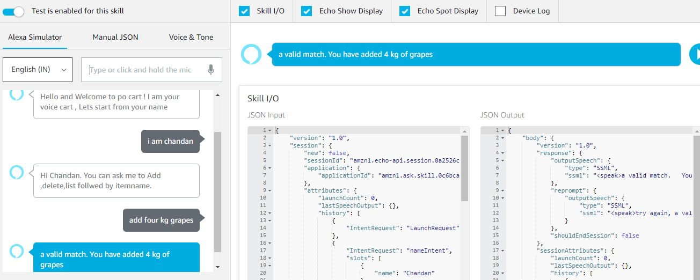

# A voice based shopping cart Alexa skill

I got this problem in Alexathon.(You can add,delete,check list items,clear all & checkout)

Here,
## frontend.json is for the frontend part,this will help to add the intents , slots & utterances.You need to add it in [Alexa skill](https://developer.amazon.com/alexa/console) json editor.
Make sure you have changed the End Point.

## Now you need to add your backend.I have written a [lambda](https://console.aws.amazon.com/lambda/home?region=us-east-1) function in index.js to identify slots , connect database([DynamoDB](https://us-east-2.console.aws.amazon.com/dynamodb/)).Make sure you have given IAM DynamoDB permission.
Create a database in DynamoDB.

